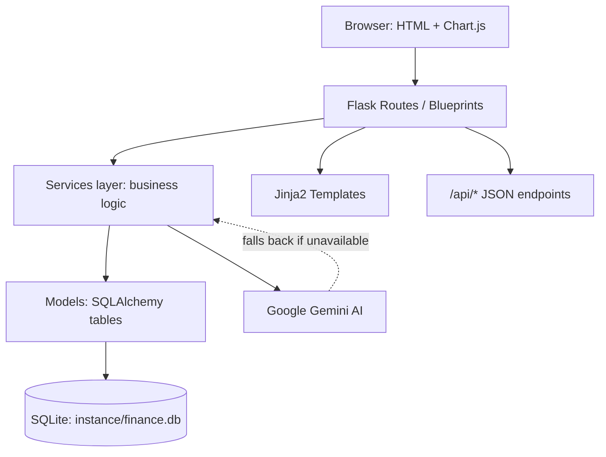
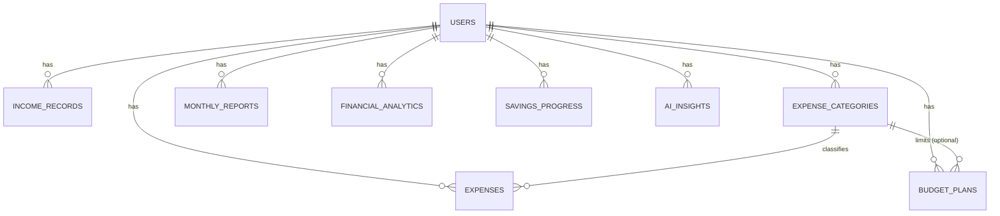
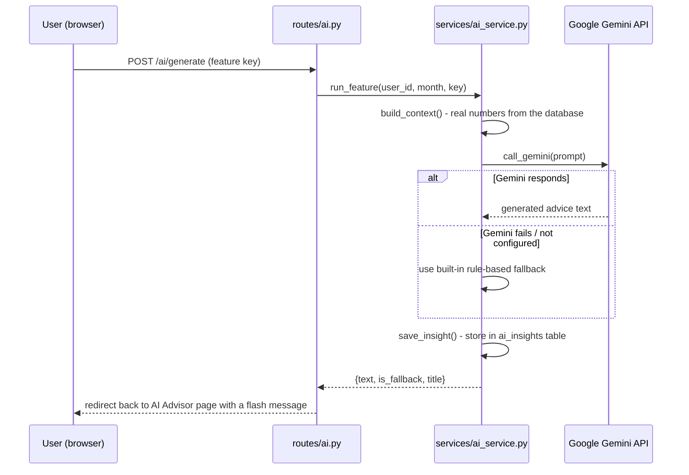

# System Architecture

## 1. Overall design

The application follows a simple **layered architecture**, which keeps each
part of the code responsible for one job:

```
Browser (HTML forms, Chart.js)
        │
        ▼
Templates (Jinja2, in templates/)
        │
        ▼
Routes / Blueprints (routes/*.py)   <- handles HTTP requests, form input,
        │                              redirects, flash messages
        ▼
Services (services/*.py)            <- all calculations and business rules
        │                              (totals, budgets, health score, AI)
        ▼
Models (models/*.py)                 <- SQLAlchemy table definitions
        │
        ▼
SQLite database (instance/finance.db)
```

This matches comments found directly in the source, for example in
`services/finance_service.py`:

> "If every route file worked out its own totals, we would end up with five
> slightly different versions of 'total expenses'. Putting the maths in one
> place means the dashboard, the reports and the budget page can never
> disagree with each other."

### Diagram



## 2. The Flask application factory

`app.py` defines `create_app(config_class)`, which:

1. Creates the Flask app and loads settings from a config class
   (`config.py`).
2. Initialises the shared `db` and `login_manager` objects from
   `extensions.py`.
3. Registers every blueprint listed in `routes/__init__.py`
   (`ALL_BLUEPRINTS`).
4. Defines the `/` and `/health` routes, plus error handlers for HTTP 400,
   401, 403, 404, 405, 413, 500, and a catch-all handler for any other
   unexpected exception (so a raw Python traceback is never shown to a
   visitor).
5. Adds three security response headers to every response
   (`X-Content-Type-Options`, `X-Frame-Options`, `Referrer-Policy`).
6. Calls `db.create_all()` inside an application context, which creates the
   SQLite tables the first time the app runs.

Using a factory function (rather than one global `app` object) is what lets
the test suite build a completely separate app with its own in-memory
database for each test run, without touching the real `instance/finance.db`
file.

## 3. Blueprints (routes/)

Each blueprint groups the routes for one feature area:

| Blueprint    | File                   | URL prefix     | Responsibility |
|--------------|------------------------|----------------|----------------|
| `auth`       | `routes/auth.py`        | `/auth`        | Register, login, logout, profile |
| `dashboard`  | `routes/dashboard.py`   | *(none)*        | `/dashboard` — the combined overview page |
| `income`     | `routes/income.py`      | `/income`      | Add / list / delete income |
| `expenses`   | `routes/expenses.py`    | `/expenses`    | Add / edit / delete expenses, manage categories |
| `budgets`    | `routes/budgets.py`     | `/budgets`     | Set budgets, view progress, apply suggestions |
| `savings`    | `routes/savings.py`     | `/savings`     | View savings progress, set targets |
| `analysis`   | `routes/analysis.py`    | `/analysis`    | Spending analysis page |
| `ai`         | `routes/ai.py`          | `/ai`          | AI Advisor page and its actions |
| `api`        | `routes/api.py`         | `/api`         | JSON endpoints used by the dashboard charts |
| `reports`    | `routes/reports.py`     | `/reports`     | View / generate / delete monthly reports |

Almost every route is protected by Flask-Login's `@login_required`
decorator, and every database query inside those routes filters by
`current_user.id`. This combination is what keeps one user's financial data
private from every other user.

## 4. Services (business logic layer)

| File                              | Responsibility |
|-------------------------------------|-----------------|
| `services/finance_service.py`       | Month math (previous/next month, month boundaries), totals, category/income breakdowns, weekly spending |
| `services/budget_service.py`        | Budget CRUD, status calculation (`on_track` / `warn` / `over`), the rule-based suggestion engine |
| `services/savings_service.py`       | Savings target vs. actual, time-aware status, history, syncing the `savings_progress` table |
| `services/analysis_service.py`      | The 100-point financial health score, overspending/near-limit detection, plain-language insights, syncing the `financial_analytics` table |
| `services/report_service.py`        | Building and freezing/saving monthly reports |
| `services/ai_service.py`            | All Gemini AI integration, prompt building, and rule-based fallbacks |
| `services/defaults.py`              | Seeds ten starter expense categories for a brand-new account |
| `services/validators.py`            | Shared input validation (amounts, dates, months, text length, email format) used across every form |

## 5. Data model (SQLAlchemy models)

All financial tables are linked back to the `users` table by a `user_id`
foreign key, and `User` declares `cascade="all, delete-orphan"` on every
relationship — so deleting a user also deletes everything that belongs to
them.



| Table                 | Model class          | Purpose |
|------------------------|-----------------------|----------|
| `users`                | `User`                 | Account, hashed password, currency, savings goal |
| `income_records`       | `IncomeRecord`         | One row per income entry |
| `expense_categories`   | `ExpenseCategory`      | User-defined spending buckets (unique per user) |
| `expenses`             | `Expense`               | One row per expense entry (category optional) |
| `budget_plans`         | `BudgetPlan`            | A planned limit for a category, or an overall monthly limit (`category_id` is `NULL`) |
| `monthly_reports`      | `MonthlyReport`         | Frozen snapshot of a month's totals and category breakdown (stored as JSON text) |
| `financial_analytics`  | `FinancialAnalytics`    | Cached per-month analysis results (health score, top category, etc.) used by the dashboard |
| `savings_progress`     | `SavingsProgress`       | Per-month savings target and achieved amount |
| `ai_insights`          | `AIInsight`             | *(supporting table, not one of the eight core tables)* stores every generated AI answer, with a flag for whether it came from Gemini or the fallback |

Amounts are stored as `Numeric(12, 2)` (not floating point) to avoid rounding
errors in money calculations. Months are stored as plain `'YYYY-MM'` text
(e.g. `'2026-09'`) rather than as a date, which makes comparing and grouping
by month simple and cheap.

## 6. Security measures actually implemented

- **Password hashing**: `werkzeug.security.generate_password_hash` /
  `check_password_hash` — passwords are never stored or compared as plain
  text (`models/user.py`).
- **Session cookies**: `HttpOnly` (blocks JavaScript from reading the
  cookie) and `SameSite=Lax` (CSRF mitigation), 7-day session lifetime
  (`config.py`).
- **Ownership checks everywhere**: every lookup, update, or delete of a
  financial record filters by both its own ID *and* `user_id=current_user.id`
  (see the comments in `routes/expenses.py` and `routes/income.py`), which
  stops one account from reading or modifying another account's data even by
  guessing an ID in the URL.
- **Logout is POST-only**: a GET request to `/auth/logout` only shows a
  confirmation page; only a POST actually logs the user out, which prevents
  a hidden image tag or link-prefetch from silently logging someone out.
- **Debug mode safety guard**: `app.py` refuses to start with
  `FLASK_DEBUG=1` on any host other than `127.0.0.1` / `localhost` / `::1`,
  because Werkzeug's interactive debugger would otherwise let anyone who can
  reach the server run arbitrary code.
- **Response security headers**: `X-Content-Type-Options: nosniff`,
  `X-Frame-Options: SAMEORIGIN`, `Referrer-Policy: same-origin` are added to
  every response.
- **Upload size limit**: `MAX_CONTENT_LENGTH` is capped at 2 MB.
- **Friendly error pages**: custom templates for 400/401/403/404/405/413/500
  instead of a raw stack trace; unhandled exceptions are logged server-side
  and never shown to the visitor.
- **Secrets stay server-side**: the Gemini API key is read only from
  `.env`/environment variables in `config.py` and is never sent to the
  browser or written into any template.

## 7. AI integration architecture



Every AI feature is built from the user's actual numbers (income, expenses,
category breakdown, budgets, health score) so Gemini is asked to *interpret*
real data rather than invent generic advice. If the Gemini call fails for any
reason, the same information is passed through a rule-based function instead,
so the feature still returns something useful, and the interface is always
told honestly which path was used (`is_fallback`).

## 8. Front-end

- **Templates** (`templates/`) are Jinja2 HTML files, organised by feature
  (`auth/`, `income/`, `expenses/`, `budgets/`, `reports/`, `ai/`, plus
  top-level pages like `dashboard.html`, `analysis.html`, `savings.html`,
  `profile.html`) and a shared `base.html` layout with the navigation bar and
  flash-message area.
- **CSS**: one stylesheet, `static/css/style.css`.
- **JavaScript**: `static/js/forms.js` (form behaviour) and
  `static/js/dashboard.js` (fetches JSON from `/api/*` and draws the three
  Chart.js charts on the dashboard).
- **Chart.js** is loaded from a CDN (`cdn.jsdelivr.net`) in `base.html`; no
  charting library is bundled locally.
